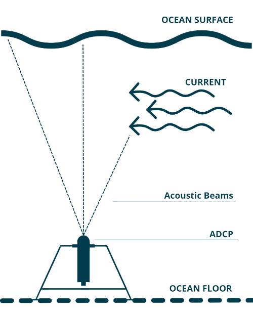

```{r, include=FALSE}
knitr::opts_chunk$set(
  echo = FALSE, 
  dpi = 600,
  fig.width = 8, 
  fig.height=4, 
  dev = "ragg_png"
)

library(adcp)
library(canadianmaps)
library(data.table)
library(lubridate)
library(ggplot2)
library(ggspatial)
library(googlesheets4)
library(ggpubr)
library(dplyr)
library(here)
library(lattice)
library(latticeExtra)
library(waves)
library(RColorBrewer)
library(readxl)
library(sf)
library(stringr)
library(tidyr)
library(viridis)

theme_set(theme_light())

param_depl_id <- params$depl_id

link <- "https://docs.google.com/spreadsheets/d/1DVfJbraoWL-BW8-Aiypz8GZh1sDS6-HtYCSrnOSW07U/edit#gid=0"

gs4_deauth()
depl_info <- googlesheets4::read_sheet(link, sheet = "Wave Tracking") %>%
  filter(depl_id == param_depl_id)

station <- depl_info$station
depl_date <- depl_info$depl_date

doc_hist <- params$doc_hist

```


```{r, message=FALSE}
# path to deployment data on R Drive
path_r <- file.path("R:/data_branches/wave/processed_data/deployment_data/")

# path from deployment folder to depl of interest
depl_path <- paste(
 depl_date, 
  station, 
  param_depl_id, sep = "_"
) %>% 
  str_replace_all(" ", "_")

path <- paste0(paste(path_r, county, depl_path, sep = "/"), ".rds")

# dat_raw <- readRDS("R:/data_branches/wave/processed_data/deployment_data/halifax/2009-12-08_Owls_Head_HL002.RDS") 

dat_raw <- readRDS(path)

dat <- dat_raw %>% 
  wv_assign_short_variable_names() %>% 
  select(
    deployment_id,
    timestamp_utc, 
    contains(c("sensor", "significant", "peak", "direction", "sea_water"))
  ) %>% 
  wv_pivot_flags_longer() %>% 
  filter(qc_flag_value < 4)

# path to most recent NSDFA tracking sheet -- update this
path_nsdfa <- file.path(
  "R:/tracking_sheets/2023-11-27 - NSDFA Tracking Sheet.xlsx"
) 

# nsdfa tracking sheet
metadata <- adcp_read_nsdfa_metadata(path_nsdfa) %>% 
  filter(Station_Name == depl_info$station, Depl_Date == depl_info$depl_date)

county <- depl_info$county
station <- depl_info$station
depl_id <- depl_info$depl_id
year_utc <- year(depl_info$depl_date)

i = 1 # counter for table
k = 1 # counter for figure number

text_size <- 3.5
crs <- 4326

```

```{r, warning=FALSE}
# set up map params

# import NS counties shapefile and remove NA row (should have 18 rows - 1 for each county)
ns <- read_sf(here("data/ns/Merged_Counties2.shp")) %>%
  na.omit() %>%
  # add column with "1" for county of interest and "0" for other counties
  mutate(
    col_county = if_else(County == county, 1, 0),
    col_county = ordered(factor(col_county), levels = c(1, 0))
  ) %>% 
  st_transform(crs = crs) 

bbox <- st_bbox(ns)
bbox[1] <- -66.45 # so that there is water around Digby Neck

nb_pei <- filter(PROV, PT == "NB"|PT=="PE") %>%
  st_transform(crs = crs) %>% 
  mutate(
    col_county = 0, 
    col_county = ordered(factor(col_county), levels = c(1, 0))
  )

can <- bind_rows(
  ns %>% st_simplify(dTolerance = 1000), 
  nb_pei
) %>% 
  st_crop(bbox) 
```


\newpage
# Introduction

The Centre for Marine Applied Research (CMAR) measures [essential ocean variables](https://goosocean.org/what-we-do/framework/essential-ocean-variables/) around the coast of Nova Scotia through the Coastal Monitoring Program. As a part of this Program, the Nova Scotia Department of Fisheries and Aquaculture (NSDFA) and CMAR have deployed Acoustic Doppler Current Profilers (ADCPs) to measure sea state (waves) and currents. This document presents deployment details and summary figures of sea state data collected for a deployment in `r county` County (Figure `r k`), at the **`r station`** Station (Figure `r k+1`) in `r year_utc` (deployment ID `r depl_id`). The corresponding current report can be found on the CMAR website [Reports page](https://cmar.ca/reports/).

The data are available for download from the Nova Scotia [Open Data Portal](https://data.novascotia.ca/browse?q=wave&sortBy=relevance). For more information on CMAR and the sea state datasets, visit the [CMAR website](https://cmar.ca/).

This document should be considered as a guide only, as data collection is ongoing. The information may be revised pending ongoing data collection and analyses.

```{r}

ggplot() +
  geom_sf(data = can, aes(fill = col_county)) +
  scale_fill_manual(values = c("#1B9E77", "grey90")) +
  theme_map() +
  coord_sf(expand = FALSE) +
  theme(
    panel.border = element_rect(colour = "black", fill = NA, linewidth = 1),
    text = element_text(size = 12),
    axis.title = element_blank(),
    legend.position = "none"
  )
```
`r cat('\n')`
Figure `r k`: `r county` County (green).

```{r, warning=FALSE, strip.white=TRUE}
k <- k + 1

# station coordinates
station_sf <- st_as_sf(
  metadata, coords = c("Depl_Lon", "Depl_Lat"), crs = crs, agr = "constant"
)

# zoom in area where station is located
ns_crop <- ns %>% 
  st_crop(st_buffer(station_sf, dist = 10000))

ggplot() +
  geom_sf(data = ns_crop) +
  geom_sf(data = station_sf) +
  coord_sf(expand = FALSE) +
  annotation_scale(location = "br") +
  annotation_north_arrow(
    location = "tl", which_north = "true",
    height = unit(1, "cm"),
    width = unit(1, "cm")
  ) +
  theme_map() +
  theme(
    panel.border = element_rect(colour = "black", fill = NA, linewidth = 1)
  )

```
`r cat('\n')`
Figure `r k`: Location of Acoustic Current Doppler Profiler deployed at the `r station` station in `r depl_info$waterbody` in `r year_utc`.

`r k <- k + 1`

## Data Collection 

NSDFA collects wave data using upward facing ADCPs that are mounted on the sea floor for 1 - 3 months (Figure `r k`). An ADCP uses sound to measure current speed and direction through the water column. ADCP software uses many measurements recorded over a given time interval to calculate key sea state parameters, including wave height, period, and direction [@RN29853]. 

NSDFA uses several ADCP instrument models, including the Sentinel V20, Sentinel V50, Sentinel V100, and Workhorse Sentinel 600kHz. NSDFA processes the data using Velocity and WavesMon4 Software [@RN29849], and sends the output to CMAR. CMAR compiles and formats the data for publication with the [waves](https://github.com/dempsey-CMAR/waves) R package [@RN29876]. 

For an overview of "Waves Basics" and the wave calculations made by the Velocity and WavesMon software, refer to @RN29850. For more details on the instruments and software, refer to @RN29853 and @RN29849. 

```{r}

```

Figure `r k`: Schematic representation of ADCP deployment (not to scale).

## Wave Parameters

Wave height is the vertical distance between the peak and trough of a wave [@RN29853]. One of the most common wave height parameters is the significant wave height, which is four times the square root of the zeroth-order moment of the wave spectrum [@RN29853]. This roughly corresponds to the average height of the largest one-third of waves in the sampling interval [@RN29853].

Wave period is the time between consecutive waves. The peak wave period is associated with the largest spike of the power spectrum for a given time interval [@RN29849]. Wave direction indicates the direction the peak wave energy is propagating towards [@RN29853]. Direction is reported here relative to True North.

Significant wave height, peak period, and wave direction figures are presented below. The ADCP software also calculates the current speed and direction from three near-surface bins as well as the sensor depth below the surface. These variables are presented to provide additional context for the wave data.

Note that the zero-up crossing wave variables (average height of the largest one-third and one-tenth of waves, maximum wave height, and their corresponding periods) are not presented here. These variables are more reliably recorded with a 5-beam ADCP, rather than the 4-beam ADCPs used by NSDFA and CMAR. Only wave variables derived from the power spectrum are presented.

In addition to wave variables detailed in this report, the ADCP also measured current speed and direction throughout the water column. A report summarizing the full current speed and direction data at this location can be found on the [CMAR website](https://cmar.ca/reports/). The corresponding Wave and Current datasets can be accessed through CMAR's [Station Location Map](https://cmar.ca/coastal-monitoring-program/) or directly from the [Nova Scotia Open Data Portal](https://data.novascotia.ca/browse?q=centre%20for%20marine%20applied%20research&sortBy=relevance).

## Quality Control

The ADCP software automatically performs some Quality Control checks during data processing [@RN29850; @RN29849]. For example, observations that are more than 5 standard deviations from the mean are discarded, and three methods for calculating wave height and period are compared.

Additional Quality Control was applied by CMAR using the [waves](https://github.com/dempsey-CMAR/waves) R package [@RN29876]. Automated Quality Control tests were applied to identify outlying and unexpected observations. For consistency with the CMAR Water Quality data, which follows Quality Assurance/Quality Control of Real-Time Oceanographic Data (QARTOD) guidance, each data point was assigned a flag of “Pass”, “Fail”, “Suspect/Of Interest”, or “Not Evaluated” [@RN25922]. These automated flags were reviewed by human experts, and modified where necessary (e.g., upgrading “Suspect/Of Interest” flags to "Fail" if there were known issues with the deployment). 

Observations flagged as “Pass” passed all tests and were included in the figures below. Observations flagged as “Suspect/Of Interest” or “Not Evaluated” were reviewed by human and experts and typically included. Observations that failed any test were considered poor quality and excluded from the figures.

For more technical details about the Quality Control tests, visit the CMAR [Data Governance website](https://dempsey-cmar.github.io/cmp-data-governance/pages/cmp_about.html).


\newpage
# `r depl_id` Wave Data

Table 1: `r depl_id` deployment details.

```{r}
metadata %>% 
  wv_write_report_table() %>% 
  wv_format_report_table() 
```


```{r, quality-control}
wave_vars <- c("significant_height_m", "peak_period_s", "to_direction_degree")

current_vars <- c("sea_water_speed_m_s", "sea_water_to_direction_degree")
```

## Wave Variables

### Time Series
```{r, fig.height=6.5}
k = k + 1

dat %>% 
  filter(variable %in% wave_vars) %>% 
  wv_plot_ts(scales = "free_y")
```
Figure `r k`: Wave variables over time.


### Frequency
```{r, fig.height=6.5, warning=FALSE, message=FALSE}
k = k + 1

pal <- c("#063E4D", "#62AECA", "#FFD118")

p1 <- dat %>% 
  filter(variable == "significant_height_m") %>% 
  wv_plot_histogram(
    binwidth = wv_get_bin_width( "significant_height_m"), 
    pal = pal[1]
  ) +
  scale_x_continuous("Wave Height (m)") +
  theme(strip.text = element_blank())
#p1

p2 <- dat %>% 
  filter(variable == "peak_period_s") %>% 
  wv_plot_histogram(
    binwidth = wv_get_bin_width("peak_period_s"),
    pal = pal[2]
  ) +
  scale_x_continuous("Peak Period (s)") +
  theme(strip.text = element_blank())

#p2

p3 <- dat %>% 
  filter(variable == "to_direction_degree") %>% 
  wv_plot_histogram(
    binwidth = wv_get_bin_width("to_direction_degree"),
    pal = pal[3]
  ) +
  scale_x_continuous("Wave Direction (degree)") +
  theme(strip.text = element_blank())

#p3

ggarrange(p1, p2, p3, ncol = 1)

```
Figure `r k`: Histogram of wave variable observations. Top: significant wave height (bin width = 0.1 m); Middle: peak period (bin width = 2 seconds); Bottom: direction the wave is travelling to (bin width = 20 degrees).

### Wave Rose

```{r, fig.height=3.25, warning=FALSE, message=FALSE}
k <- k + 1

get_wv_rose_cols <- colorRampPalette(c("#c7dfe7", "#063E4D"))

dat_wide <- dat %>% 
  pivot_wider(names_from = "variable", values_from = "value") %>% 
  select(-contains("flag"))

breaks_wv <- seq(
  0, round(max(dat_wide$significant_height_m, na.rm = TRUE)), by = 0.25
) 

colors_wv <- get_wv_rose_cols(length(breaks_wv))

ints_wv <- adcp_count_obs(dat_wide, significant_height_m, n_ints = length(breaks_wv)
)
dir_label_wv <- round(max(ints_wv$prop))

p <- adcp_plot_current_rose(
  dat_wide, 
  breaks = breaks_wv, 
  speed_column = significant_height_m,
  direction_column = to_direction_degree,
  speed_colors = colors_wv,
  speed_label = "Wave Height (m)"
)

p
```
Figure `r k`: Wave height and the direction the wave is travelling to (relative to True North).

\newpage
## Current

```{r, fig.height=3.25}
cat('\n')

k <- k + 1

#get_curr_cols <- colorRampPalette(c("#E8E8E8", "#3A9DCA", "#104862"))
# get_curr_cols <-  colorRampPalette(c("#D1D1D1", "#2972BA", "#112F4D"))
# 
# get_curr_cols <- colorRampPalette(c("#c7dfe7", "#063E4D"))
#  
dat_wide <- dat_wide %>% 
  mutate(sea_water_speed_cm_s = sea_water_speed_m_s * 100) %>% 
  select(-sea_water_speed_m_s)

n_ints <- 12
colors_curr <- viridis(n_ints, option = "F", direction = -1)
ints_curr <- adcp_count_obs(dat_wide, sea_water_speed_cm_s)

breaks_curr <- c(ints_curr$lower, max(ints_curr$upper)) # NOT a mistake that using max(upper)
dir_label_curr <- round(max(ints_curr$prop))

p_curr <- adcp_plot_current_rose(
  dat_wide, 
  breaks = breaks_curr, 
  speed_column = sea_water_speed_cm_s,
  direction_column = sea_water_to_direction_degree,
  speed_colors = colors_curr
)

p_curr
```

```{r, fig.height=2.6}
adcp_plot_speed_hist(ints_curr, bar_cols = colors_curr)
```

Figure `r k`: Current speed and direction for three near-surface bins. Top: Current speed and the direction the current is travelling to (relative to True North). Bottom: Current speed distribution. The number of observations is noted above each bar.

## Depth

```{r, fig.height=2.6}

cat('\n')

k <- k + 1

dat_wide %>% 
  adcp_plot_depth(geom = "line")
```
Figure `r k`: ADCP sensor depth below the surface over time.

#	Data Acknowledgement 

CMAR aims to prioritize data collection and processing efforts that best serve coastal stakeholders. If you use this Coastal Monitoring Program Water Quality data in a project or for decision making, please complete our [anonymous questionnaire](https://docs.google.com/forms/d/1RmHN1vDaM0dXqKFKy8V-traIoubdw1pqMDKVtPmWDHc/edit) with your feedback. Please cite the report and/or datasets used.
<br>

# Document History

```{r, doc-history}
doc_hist %>%
  select(-contains("Depl_ID")) %>%
  wv_format_report_table(transpose = FALSE) 
```

# References


