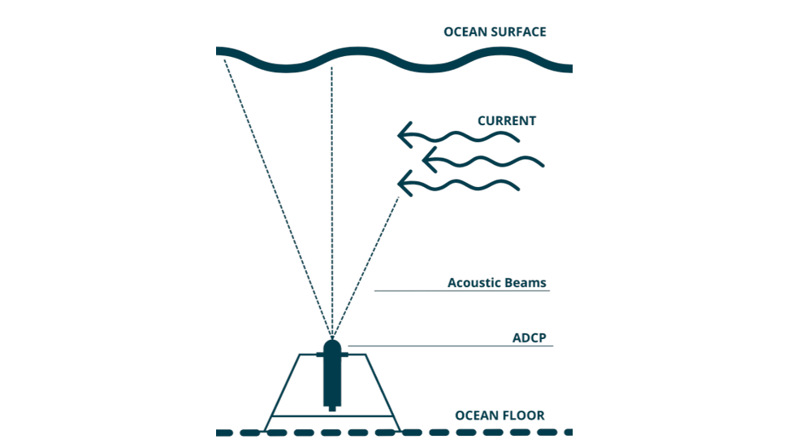

```{r, include=FALSE}
knitr::opts_chunk$set(echo = FALSE, dpi = 600, fig.width=8, dev = "ragg_png")

library(adcp)
library(canadianmaps)
library(ggplot2)
library(ggspatial)
library(readr)
library(dplyr)
library(here)
library(sf)

theme_set(theme_light())


# library(openair)
# library(ggplot2)
# library(ggspatial)
# library(sf)
# library(ggsflabel)
# library(dplyr)
# library(viridis)
# library(RColorBrewer)
# library(readr)
# library(lubridate)
# library(knitr)
# library(openair)
# library(tidyverse)
# library(flextable)
# library(officer)
```


```{r, echo=FALSE, message=FALSE}

# update this be be a param
dat <- read_csv("R:/data_branches/wave/processed_data/deployment_data/annapolis/new/2020-10-22_Cornwallis NE_AN001.csv")

link <- "https://docs.google.com/spreadsheets/d/1DVfJbraoWL-BW8-Aiypz8GZh1sDS6-HtYCSrnOSW07U/edit#gid=0"

depl_id <- googlesheets4::read_sheet(link, sheet = "Wave Tracking") %>% 
  filter(depl_id == unique(dat$deployment_id))

# path to most recent NSDFA tracking sheet -- update this
path_nsdfa <- file.path(
  "R:/tracking_sheets/2023-11-27 - NSDFA Tracking Sheet.xlsx"
) 

# nsdfa tracking sheet
tracking <- adcp_read_nsdfa_metadata(path_nsdfa) %>% 
  filter(Station_Name == depl_id$station, Depl_Date == depl_id$depl_date)

county <- depl_id$county

i = 1 # counter for table
k = 1 # counter for figure number
text_size <- 3.5
crs <- 4326
```

```{r, warning=FALSE}
# set up map params

# import NS counties shapefile and remove NA row (should have 18 rows - 1 for each county)
ns <- read_sf(here("data/ns/Merged_Counties2.shp")) %>%
  na.omit() %>%
  # add column with "1" for county of interest and "0" for other counties
  mutate(
    col_county = if_else(County == county, 1, 0),
    col_county = ordered(factor(col_county), levels = c(1, 0))
  ) %>% 
  st_transform(crs = crs) 

bbox <- st_bbox(ns)
bbox[1] <- -66.45 # so that there is water around Digby Neck

nb_pei <- filter(PROV, PT == "NB"|PT=="PE") %>%
  st_transform(crs = crs) %>% 
  mutate(
    col_county = 0, 
    col_county = ordered(factor(col_county), levels = c(1, 0))
  )

can <- bind_rows(
  ns %>% st_simplify(dTolerance = 1000), 
  nb_pei
) %>% 
  st_crop(bbox) 
```

# Introduction

The Centre for Marine Applied Research (CMAR) measures [essential ocean variables](https://goosocean.org/what-we-do/framework/essential-ocean-variables/) around the coast of Nova Scotia through their Coastal Monitoring Program. Through this Program, the Nova Scotia Department of Fisheries and Aquaculture (NSDFA) and CMAR have deployed Acoustic Doppler Current Profilers (ADCPs) at a variety of locations to measure sea state (waves) and currents. This document presents deployment details and summary figures of sea state data collected for deployment **`r depl_id$depl_id`** in `r county` County (Figure `r k` and Figure `r k+1`). The corresponding current report can be found on the CMAR website [Reports page](https://cmar.ca/reports/).

The data are available for download from the Nova Scotia [Open Data Portal](https://data.novascotia.ca/browse?q=wave&sortBy=relevance). For more information on CMAR and the sea state datasets, visit the [CMAR website](https://cmar.ca/).

This document should be considered as a guide only, as data collection is ongoing. The information may be revised pending ongoing data collection and analyses.

```{r}

ggplot() +
  geom_sf(data = can, aes(fill = col_county)) +
  scale_fill_manual(values = c("#1B9E77", "grey90")) +
  theme_map() +
  coord_sf(expand = FALSE) +
  theme(
    panel.border = element_rect(colour = "black", fill = NA, linewidth = 1),
    text = element_text(size = 12),
    axis.title = element_blank(),
    legend.position = "none"
  )
```
`r cat('\n')`
Figure `r k`: `r county` County (green).


```{r, warning=FALSE, strip.white=TRUE}
k <- k + 1

# station coordinates
station_sf <- st_as_sf(
  tracking, coords = c("Depl_Lon", "Depl_Lat"), crs = crs, agr = "constant"
)

# zoom in area where station is located
ns_crop <- ns %>% 
  st_crop(st_buffer(station_sf, dist = 10000))

ggplot() +
  geom_sf(data = ns_crop) +
  geom_sf(data = station_sf) +
  coord_sf(expand = FALSE) +
  annotation_scale(location = "br") +
  annotation_north_arrow(
    location = "tl", which_north = "true",
    height = unit(1, "cm"),
    width = unit(1, "cm")
  ) +
  theme_map() +
  theme(
    panel.border = element_rect(colour = "black", fill = NA, linewidth = 1)
  )

```
`r cat('\n')`
Figure `r k`:  deployment in `r depl_id$waterbody`.


\newpage
## Data Collection 

CMAR collects wave data using upward facing ADCPs mounted on the sea floor.  


Wave datasets consist of time-series measurements of significant wave height, wave period, and average wave direction, with data measured at a frequency of 10 minutes to 1 hour depending on the deployment. Each ADCP is deployed on the seafloor and can measure
water speed throughout the water column. ADCPs transmit ultrasonic “pings” of
sound at a specific frequency. The pings are measured as they reflect back from particles in the water column. Sound reflecting from particles moving away from the ADCP have a slightly lower
frequency than sound reflected from particles moving toward the instrument. The difference in
frequencies is called a Doppler Shift and is used to calculate water speed and direction.

Each individual row of data (ensemble) from the ADCPs presents wave height (significant, maximum, height average of the top 1/3, and 1/10 largest waves) measured in metres, period (peak, maximum, period average of the top 1/3, and 1/10 largest waves) measured in seconds and peak wave direction in degrees relative to true north. Each individual row of data (ensemble) from the wind-wave buoys presents wave height (significant, maximum) in metres and average wave direction in degrees relative to true north, corrected for localized magnetic declination specific to the deployment coordinates. The Ensemble Interval (time between averaged measurements) varies between data sets depending on the configuration of the instrument used for a given deployment, as indicated in Table 1 below. 

\newpage
```{r}

k <- k + 1
```

Figure `r k`: Schematic representation of ADCP deployment (not to scale).

`r knitr::knit_exit()`

## Data Terminology & Notes

Ensemble Interval - Time (seconds) between the beginning of one data recording and the next.

Averaging Interval - Time (seconds) over which multiple recordings are taken and averaged during each ensemble.

Pings/Ensemble - Number of individual recordings taken and averaged over the course of the averaging interval.

Bin Size - Vertical size (metres) of parcels from which current data are recorded throughout the water column.

Hmax - Maximum wave height (metres).

Hs - Significant wave height (metres).

Tp - Peak wave period (seconds).

Dp - Peak wave direction from which the wave is travelling (degrees relative to true north) at the peak period.

AverageDirection - The average value of all valid readings of the direction from which the wave is travelling, recorded across all bins over the course of the ensemble.

**Note:**

All wave data presented in this report are travelling towards the sensor. All compass headings are relative to True North.

Parameters measured may differ based on instrument model.

"ADCP" refers to the following instrument models: "Sentinel V20", "Workhorse Sentinel 600kHz", "Sentinel V100", and "Sentinel V50". 

\newpage
# `r depl_id$depl_id` Sea State Data
Table 1: Deployment details for `r depl_id$depl_id`
```{r, echo=FALSE, message=FALSE,results='asis'}
write_metadata_table<-function (metadata) 
{
  table.out <- metadata %>% 
    select(`Deployment ID` = `Deployment ID`,
                               `Station Name` = `Station Name`,
                               `Instrument Model` = Model,
                               Latitude = `Deployment Latitude`, 
                               Longitude = `Deployment Longitude`,
                               `Deployment Date` = `Deployment Date`, 
                               `Recovery Date` = `Recovery Date`, 
                               `Deployment Duration (d)` = `Deployment Duration`,
                               `Depth (m)` = `Depth`,
                               `Ensemble Interval (s)` = `Ensemble Interval`,
                               `Averaging Interval (s)` =  `Averaging Interval`,
                               `Pings/Ensemble` = `Pings per Ensemble`,
                               `Bin Size (m)` = `Bin Size`,
                               `First Bin Range` = `First Bin Range`)%>% 
    mutate(`Depth (m)` = as.numeric(`Depth (m)`))
  
  table.out
}


table <- write_metadata_table(filter(metadata,`Deployment ID` == deployment_ID))
t_table <- data.frame(t(table)) %>% 
  mutate( Record = colnames(table)) %>% 
  select( Record, 'Deployment Info' = 1)
rownames(t_table) <- NULL

# kable(t_table, align = "l",
#       caption = paste("Table 1: Deployment details for ", deployment_ID , sep = ""))

flextable<-flextable(t_table)
flextable <-delete_part(flextable,part="header")

small_border = fp_border(color="gray", width = 1)
flextable<-vline(flextable, border = small_border, part = "all" )%>%
  border_outer(part="all", border = small_border )%>%
  border_inner_h(part="all", border = small_border )%>%
  border_inner_v(part="all", border = small_border )%>%
  bold(i = NULL, j = 1, bold = TRUE, part = "body")
flextable %>% autofit() %>% fit_to_width(7.5)


```

\newpage
## Time Series Plot
```{r, results="asis", eval=TRUE}
k = k+1

#c("darkblue","lightblue")

ggplot(dat, aes(timestamp_utc, Hs)) +
  geom_col(color = "darkblue")

ggplot(dat, aes(timestamp_utc, Hs)) +
  geom_line(color = "darkblue")

ggplot(dat, aes(Hs)) + geom_histogram(binwidth = 0.05)
ggplot(dat, aes(Tp)) + geom_histogram(binwidth = 2)

ggplot(dat, aes(timestamp_utc, Tp)) +
  geom_point()

ggplot(dat, aes(timestamp_utc, Tp)) +
  geom_line()


ggplot(dat, aes(timestamp_utc, Hmax)) +
  geom_col(color = "darkblue")


```
Figure `r k`: Maximum wave height (Hmax) & significant wave height (Hs) at `r deployment_ID` deployed in `r year`.


\newpage
## Frequency Plots 
Note, zero readings for Figure `r k+1` and Figure `r k+2` have been removed for ease of interpretation. 

```{r, echo = FALSE, message=FALSE, warning=FALSE, error=FALSE, results="asis", eval=TRUE,fig.width=6.5}
k = k+1

ggplot(filter(deployment,Hmax!=0,preserve=TRUE),aes(x=Hmax))+geom_histogram(binwidth =0.01)+xlab("Hmax (m)")
```
Figure `r k`: Frequency of maximum wave height (Hmax) at `r deployment_ID` deployed in `r year`. Plot bin width is 0.01 metres.

\newpage
```{r, echo = FALSE, message=FALSE, warning=FALSE, error=FALSE, results="asis", eval=TRUE,fig.width=6.5}
k = k+1

ggplot(filter(deployment,Hs!=0,preserve=TRUE),aes(x=Hs))+geom_histogram(binwidth =0.01)+xlab("Hs (m)")
```
Figure `r k`: Frequency of significant wave height (Hs) at `r deployment_ID` deployed in `r year`. Plot bin width is 0.01 metres.

```{r, echo = FALSE, message=FALSE, warning=FALSE, error=FALSE, results="asis", eval=TRUE,fig.width=6.5}
k = k+1

ggplot(deployment,aes(x=Tp))+geom_histogram(binwidth = 0.1)+xlab("Tp (s)")

```
Figure `r k`: Frequency of peak wave period (Tp) at `r deployment_ID` deployed in `r year`. Plot bin width is 0.1 seconds.
\newpage

## Wave Rose Plot
```{r, echo = FALSE, results="asis", eval=TRUE,fig.width=7}
k = k+1
if(depl_metadata$Model %in% c("Sentinel V20","Workhorse Sentinel 600kHz", "Sentinel V100","Sentinel V50")){
pollutionRose(deployment,ws="Hs",wd="Dp",
              pollutant = "Hs",
              key.footer="Significant Wave Height (m)",
              annotate=FALSE,
              breaks=c(0, 0.25, 0.5, 0.75,1,1.25,1.5,1.75,2,2.25,2.5,3,4),
              cols="heat")
}else if (depl_metadata$Model %in% c("Xeos Buoy", "MarineLabs Buoy")){
  pollutionRose(deployment,ws="Hs",wd="AverageDirection",
              pollutant = "Hs",
              key.footer="Significant Wave Height (m)",
              annotate=FALSE,
              breaks = c(0, 0.25, 0.5, 0.75,1,1.25,1.5,1.75,2),
              cols="heat")

}


# windRose(deployment, ws="Hs", wd="Dp",
#          breaks=7,
#          increment=0.25,
#          cols = viridis(7),
#          paddle = F,
#          auto.text = F,
#          annotate = F,
#          key.footer = "Significant Wave Height (m)",
#          key.position = "right")


```
Figure `r k`: Frequency of significant wave height (m) by wave direction (Dp or AverageDirection) at `r deployment_ID` deployed in `r year`.

